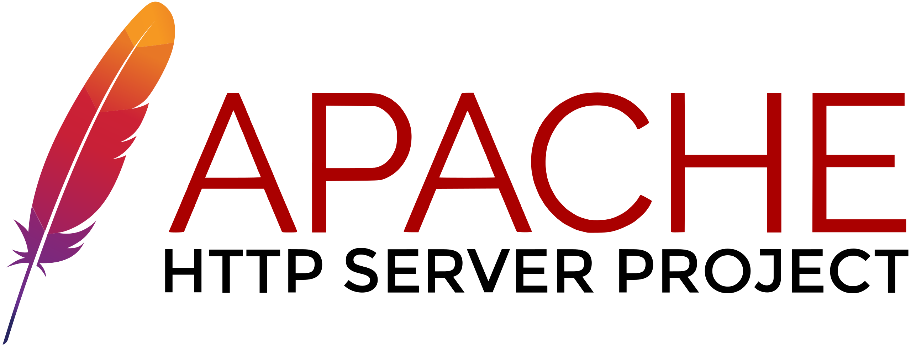
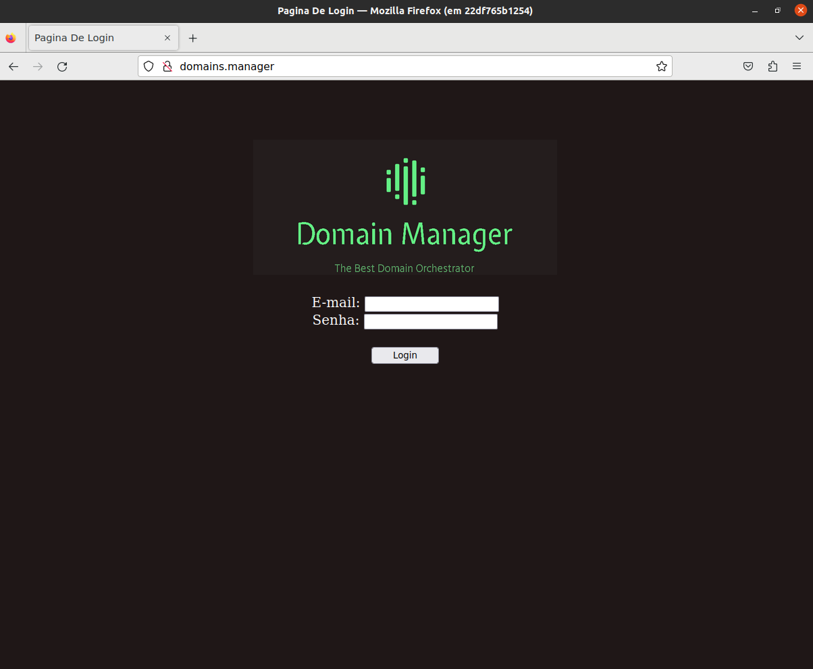
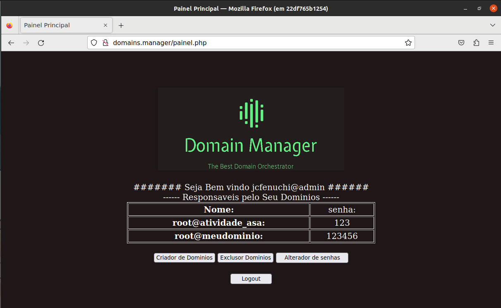
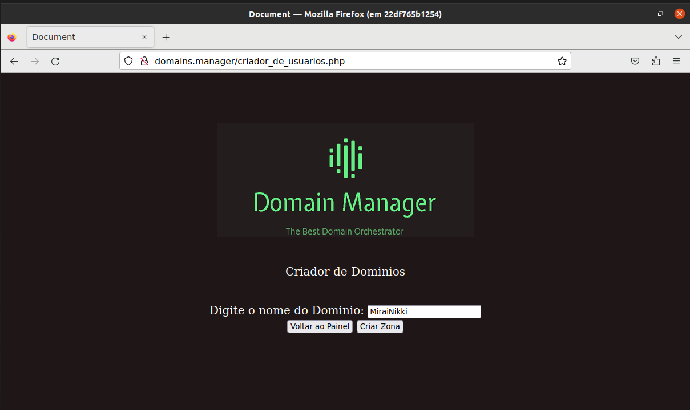
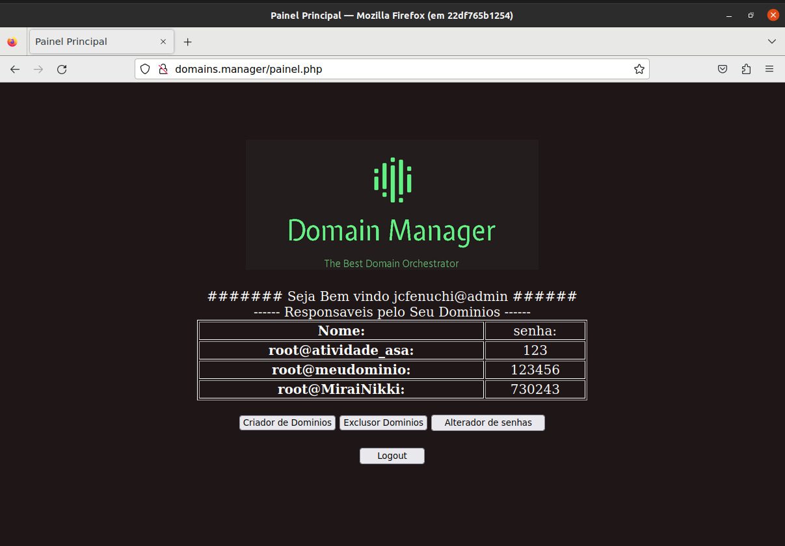
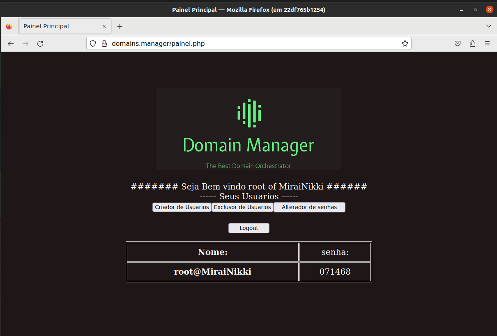
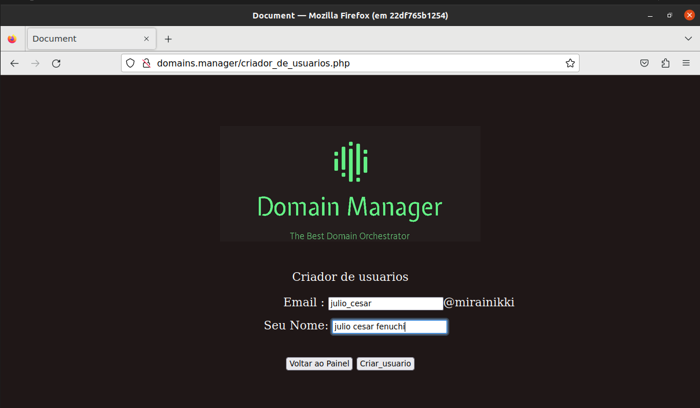
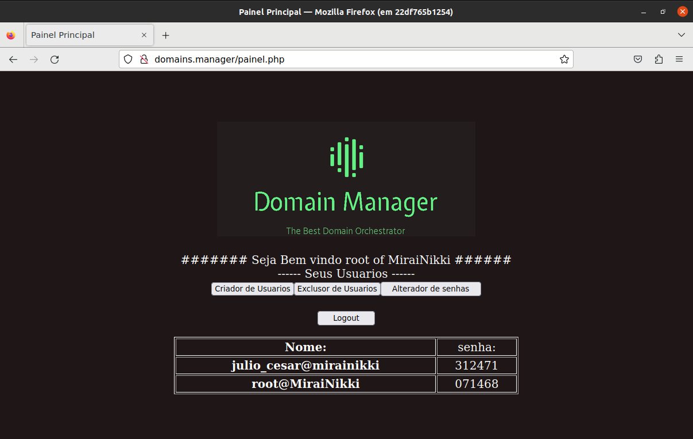
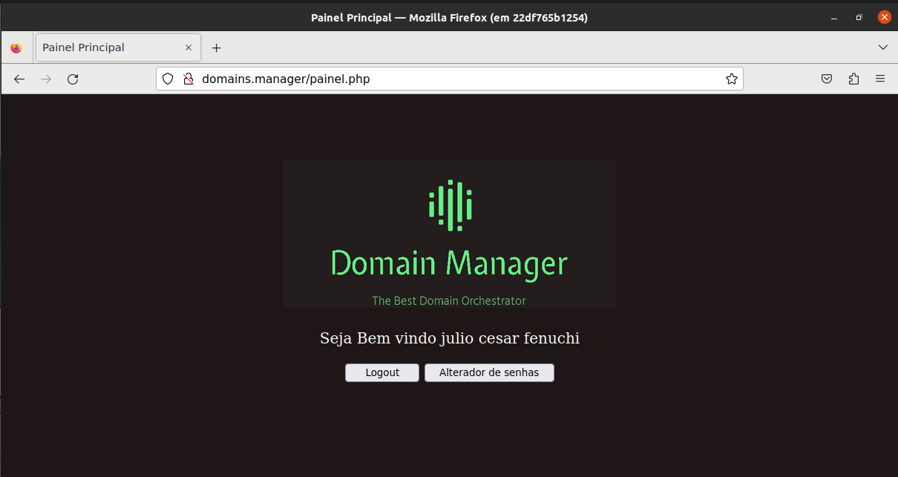
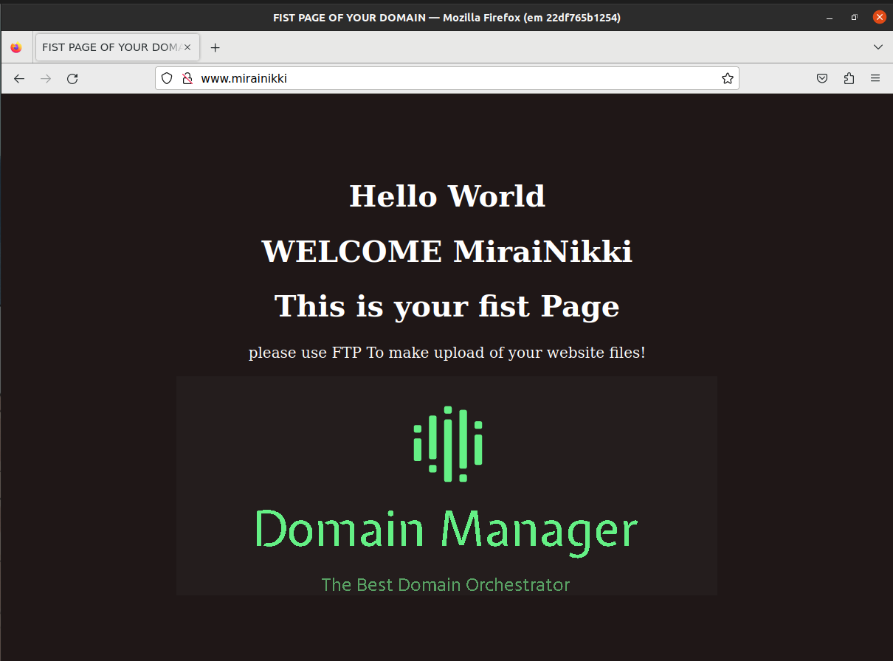

<!DOCTYPE html>
<html lang="en">
<head>
</head>

<body>
    <h1>☆ pagina de explicação do projeto ☆</h1> 
    

        
<h3 style="text-align:center" >Olá Saudações, sou julio cesar. </a></h3>  
              
        
&emsp;&emsp;esse resultado é fruto do meu projeto da disciplica que chamamos de ASA( Administração de Sistemas Abertos ) da grade de Redes de computadores.
        onde aprendemos sobre DNS, DHCP, APACHE, FTP, serviço de email(Postfix/dovecot), basico de Banco de dados e PhP.
        

no processo desenvolvimento foi dado um ambiente pelo professor com tudo instalado para cada aluno.
        após o termino do semestre resolvi desenvolver o ambiente em docker( no qual estudei por fora da materia ), tal esse que eu poderia demostrar em poucos comandos um ambiente
        que pode ser usado internamente de fomas adaptativas de forma persistente ou não.
        

        
o ambiente criado conta com um (Mozilla firefox, Bind9, apache e php) e uma imagem com Mysql para o banco de dados.
        após o inicios #docker-compose up --build ou pode ser usado docker stack ele vai fazer o deploy das imagens e vai abrir uma interface grafica do firefox apontando para localhost que vai ter 3 paginas, 
        uma para visualizar essa pagina, outra para visualizar as tabelas importantes do banco de dados, principal a pagina de login cuja eu chamei http://domains.manager.  OBS:só possui acesso aos sites caso seja usado o servidor de DNS 172.20.0.2 .
        
 
        
        
após o acesso a http://domains.manager voce deve fazer o login com o seu tipo de usuario da Hierarquia abaixo:
            

↣tipo root -> localizados na tabela root_users o root pode criar/excluir dominios acessaveis, troca sua senha de login e dos administradores de dominio.

            criando novo dominio MiraiNikki: 
            
            
            
            
↣tipo adminstrador -> localizado na tabela ftpusers o adminstrador pode criar/excluir usuarios, troca sua senha de login e dos usuarios 

            criação de um novo Usuario: 
            
            
            
            
↣tipo usuario -> localizado na tabela ftpusers o usuario pode apenas trocar a propia senha.

            logando com o usuario criado acima: 
             
            lembrando que caso o root crie um dominio MirraiNikki voce poderar acessar ele atraves de http://MiraiNikki ou http://www.MiraiNikki no seu navegador e terar uma pagina padrão preparada para voce. 
             
            caso voce feche o firefox e precise executar novamente use o seguinte comando:  #docker exec -it dns-server firefox localhost  
            para editar arquivos em runtime: #docker exec -it dns-server bash 

        
Observações: esse codigo não foi feito pensando em segurança, a logo usada é fictícia, o codigo pode ser aprimorado em alguns requisitos, sinta-se livre para entrar em contato ou aprimorar o codigo de acordo com sua preferencia.

 se voce quiser aprender mais sobre DNS acesse <a href="https://www.zytrax.com/books/dns/">livro sobre DNS</a>.

 

 
</body>
</html>
